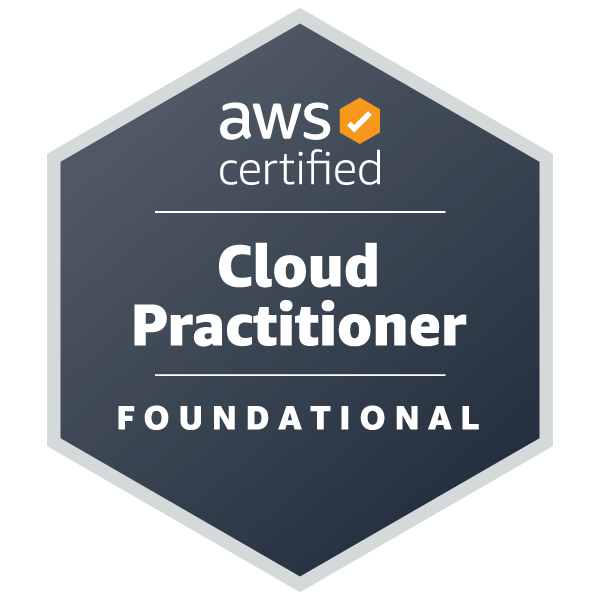

<!-- <h2> Hi 👋, I'm Achyuth </h2> -->

# Hi 👋, I'm Achyuth

<!--  -->

<!--  -->

<!--  -->

<!-- 
<iframe src="https://giphy.com/embed/STx3VQPPCgvbzIKlw4" width="100%" height="100%" style="position:absolute" frameBorder="0" class="giphy-embed" allowFullScreen></iframe> -->

## Full-Stack Developer

Currently pursuing MS in Information Systems (Computer Software Engineering) at Northeastern University, Boston. Worked as a frontend engineer at Capgemini, Hyderabad

- 🌍  From: Hyderabad, TS, India
- 📍 Present: Boston, MA, US
- 🖥️  See my portfolio at [achyuthvarmap.com](http://achyuthvarmap.com)
- ✉️  You can contact me at [achyuth.varma1@gmail.com](mailto:achyuth.varma1@gmail.com)

## Skills

<!--  -->

<!--  -->

## Professional Certifications

## Socials

     

<!--  -->

### Badges

<b>My GitHub Stats</b>

<!-- <b>Top Repositories</b>

        -->

<!--  -->

## Projects

### Full-Stack Booking Application

- [Application URL]()\
  [Github Organization Link](https://github.com/ticketing-software)

### Mini Posts and Comments Full stack App

- [Application URL]()\
  [Github Organization Link](https://github.com/custom-posts-comments-app)

### Pizza Ordering BOT using Microsoft BOT and Spring Boot

- [Github Organization Link](https://github.com/Pizza-Bot)

### CSS Projects

1. [Tour website](https://varma-pa.github.io/Advanced-CSS/)\
   [Github-Repo](https://github.com/Varma-PA/Advanced-CSS)

### Simple Password Generator Application - Angular

1. [Password Generator Link](https://password-generator-pink-pi.vercel.app/)\
   [Github-Repo](https://github.com/Varma-PA/Simple-Angular-Password-Generator)

# Frameworks and Libraries

### Backend

- Express
- Spring Boot
- Flask

### Frontend

- React
- Next JS

### DevOps

- Github Actions
- Jenkins

### Containerization

- Docker
- Kubernetes

### Data Science Tools

- Scikit Learn
- Numpy
- Pandas

<!-- ## Professional Certifications

  -->

### Thank you very much for visiting my GitHub Profile. Hope you have a great day

 
 

<!--  -->
